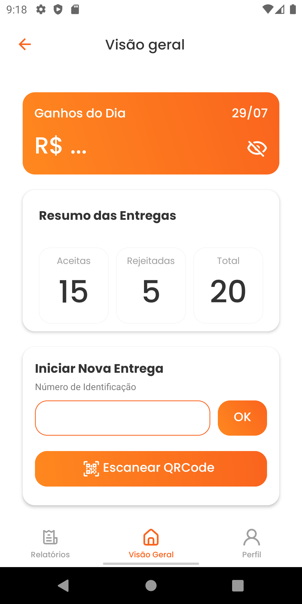
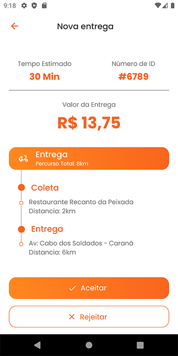

# Pigz - Projeto para Processo Seletivo

Este repositório contém o código-fonte e as imagens do projeto Pigz, desenvolvido para um processo seletivo. O Pigz é um aplicativo de entrega de comida que permite aos usuários fazer pedidos de restaurantes locais.

## Demonstração

##LINK PARA BAIXAR o APK
<a href="c./image/app-release.apk">Baixar o aplicativo</a>

Aqui estão algumas capturas de tela do aplicativo Pigz:

  
  
  
  
    

## Tecnologias utilizadas

- HTML
- CSS
- JavaScript

